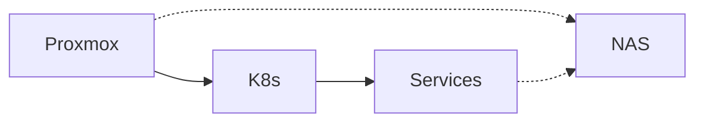

# Homelab GitOps Repository

## Video Tutorial

[](https://www.youtube.com/watch?v=5YFmYcic8XQ)

Watch the complete homelab setup walkthrough on YouTube.

## Architecture Overview



## Directory Structure

```
/home/decoder/dev/homelab
├── docs/                    # Essential documentation
│   ├── CLAUDE.md           # Claude AI context
│   ├── README.md           # This file
│   └── secrets-management.md
├── gitops/                  # All Kubernetes manifests
│   ├── apps/               # Application deployments
│   │   ├── homepage.yaml   # Homepage dashboard
│   │   ├── minio.yaml      # MinIO object storage
│   │   ├── portainer.yaml  # Portainer UI
│   │   └── velero.yaml     # Backup solution
│   ├── clusters/
│   │   └── homelab/        # ArgoCD root applications
│   │       ├── apps.yaml
│   │       └── infrastructure.yaml
│   └── infra/              # Infrastructure components
│       ├── eso-*.yaml      # External Secrets Operator
│       ├── metallb-*.yaml  # Load balancer
│       └── prometheus.yaml # Monitoring stack
├── scripts/                 # Utility scripts
│   └── check-metallb-health.sh
├── terraform/               # Infrastructure as Code
│   └── argocd/             # ArgoCD Terraform deployment
├── devbox.json             # Development environment
└── justfile                # Task automation
```

## Quick Start

### Prerequisites
- Kubernetes cluster (1.28+)
- `kubectl` configured
- Terraform installed
- `just` command runner (optional but recommended)

### Available Tools (via devbox)
```bash
devbox shell  # Enters shell with all tools
```
Provides: `kubectl`, `helm`, `terraform`, `argocd`, `istioctl`, `kn`, `fluxcd`

## Deployment

### 1. Bootstrap ArgoCD with Terraform
```bash
cd terraform/argocd
terraform init
terraform apply
```

### 2. Access ArgoCD
```bash
# Using justfile recipes
just launch_argo  # Opens UI and copies password

# Or manually:
kubectl -n argocd get secret argocd-initial-admin-secret -o jsonpath="{.data.password}" | base64 -d
```

### 3. Deploy Applications
```bash
kubectl apply -f gitops/clusters/homelab/
```

## Key Features

- **GitOps with ArgoCD**: All deployments via Git commits
- **Secret Management**: HashiCorp Vault + External Secrets Operator
- **Load Balancing**: MetalLB for bare-metal LoadBalancer services
- **Monitoring**: Prometheus + Grafana stack
- **Backup**: Velero with MinIO backend
- **Dashboard**: Homepage with service integration
- **AI Platform**: Kagent with local Ollama integration

## Useful Commands

See `just --list` for all available commands:
- `just launch_argo` - Open ArgoCD UI with password in clipboard
- `just launch_homepage` - Open Homepage dashboard
- `just argo_suspend` - Disable auto-sync for all apps
- `just argo_resume` - Re-enable auto-sync for all apps
- `just argo_stop` - Stop ArgoCD controller completely
- `just argo_start` - Start ArgoCD controller
- `just argo_status` - Check sync status of all applications
